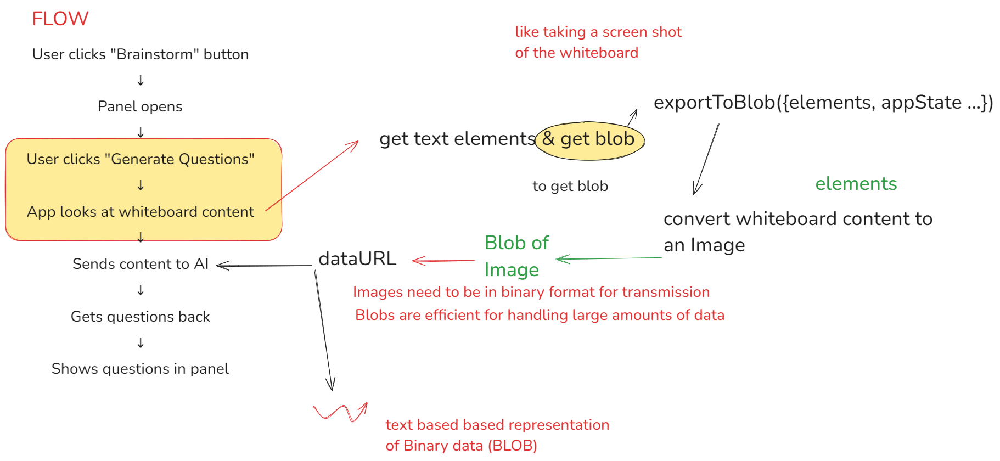

<a href="https://excalidraw.com/" target="_blank" rel="noopener">
  <picture>
    <source media="(prefers-color-scheme: dark)" alt="Excalidraw" srcset="https://excalidraw.nyc3.cdn.digitaloceanspaces.com/github/excalidraw_github_cover_2_dark.png" />
    
  </picture>
</a>

## Implementation of new BrainStorming Feature 

- General Flow of the application

- The new BrainStorming Feature flow

- Implementation flow

- A look at the feature (example: business elements)

### The AI API (Backend service)
- Gemini AI
- The AI model used is gemini-pro
- The API endpoint is https://brainstormbackend-vh9n.onrender.com/v1/ai/brainstorm/generate (This custom API is deployed on Render)
- Repository: https://github.com/saikiran76/BrainStormBackend

